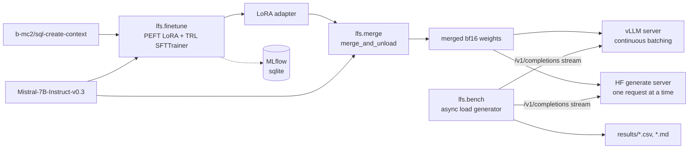

# Architecture

## Pipeline

Each stage is a module under `src/lfs` driven by a YAML file in `configs/`. `smoke.yaml` runs the whole chain on a 0.5B model on a laptop CPU. `mistral7b.yaml` is the real run on one 24 GB GPU. `modal_app.py` runs the GPU stages on Modal.

Both servers speak the same subset of the OpenAI completions API: streaming, `max_tokens`, `ignore_eos`, and `stream_options.include_usage`. One client measures both, so the comparison changes only the serving engine.

## Decisions

### LoRA instead of a full fine-tune

A full fine-tune of a 7B model in bf16 with Adam needs about 16 bytes per parameter for weights, gradients and optimizer state. That is over 100 GB before activations, which means several 80 GB cards. LoRA freezes the base weights and trains low-rank updates on the attention and MLP projections. With r=16 on all seven projection types that is about 42M trainable parameters, around 0.6% of the model. The frozen base stays in bf16 (about 14.5 GB) and the optimizer state is tiny, so the run fits on one 24 GB L4.

The cost is capacity. LoRA is good at teaching format and a narrow task, which is what text-to-SQL on a fixed prompt template is. It is weaker at adding new knowledge. For this task that tradeoff is fine.

I merge the adapter into the base weights before serving. vLLM can serve unmerged adapters, but a merged model removes the adapter matmuls from every forward pass and makes the vLLM and HF servers load the same checkpoint.

### vLLM for serving

vLLM does three things that matter here. It schedules at the level of single decode iterations (continuous batching). It stores the KV cache in fixed-size blocks (PagedAttention), so memory is not reserved for a sequence's maximum length up front. And it exposes an OpenAI-compatible server, so the benchmark client is ordinary HTTP. TGI and TensorRT-LLM would also work. I picked vLLM because it installs from PyPI, runs any Hugging Face checkpoint without a compile step, and is what most teams reach for first.

### What continuous batching changes

A plain `generate` call decodes a fixed batch until every sequence in it finishes. A request that arrives mid-decode waits for the whole batch. In the baseline server that means one request at a time behind a lock, which is how most naive serving code behaves.

Decoding a 7B model is limited by memory bandwidth: every step reads all the weights once no matter how many sequences are in the batch. So one sequence at a time leaves most of the GPU idle. Continuous batching adds new requests to the running batch at the next decode step and removes finished ones immediately. Each weight read serves many sequences. Aggregate tokens per second should rise with concurrency until compute or KV cache memory runs out, while per-request decode speed drops somewhat.

What the benchmark should show if this works: at concurrency 1 the two servers are close. As concurrency rises, the baseline's throughput stays flat and its TTFT grows with queue depth. vLLM's throughput climbs and its TTFT stays near the prefill time. The CPU smoke test already shows the baseline half of this: at concurrency 2 its TTFT jumps from about one prefill to about one full request, because the second request waits in the queue. Those CPU numbers are only a check that the harness measures what it should, and they are not in the results table.

### How the benchmark avoids common mistakes

- **TTFT is measured at the client.** The clock starts when the request is sent and stops at the first streamed chunk that carries text. Server-side TTFT leaves out queueing, which is the thing continuous batching fixes. The client runs in the same container as the server, so network time is not included either.
- **Warmup is excluded.** Each concurrency level first sends 4 requests that are thrown away. They absorb CUDA graph capture, allocator growth and lazy initialization.
- **Prompt length is fixed.** Every prompt is cut to exactly 256 tokens with the served model's own tokenizer. The server's reported `prompt_tokens` is recorded so this can be checked in the CSV.
- **Output length is fixed.** `max_tokens=128` with `ignore_eos=true`, so every request decodes the same number of tokens. Without this, a model that stops early looks faster.
- **Prompts are distinct.** Each prompt starts from a different dataset row, so vLLM's prefix cache cannot serve all requests from one cached prefix.
- **Token counts come from the server.** Streamed chunks can hold more than one token, so counting chunks undercounts. The client asks for `include_usage` and uses the server's `completion_tokens`. A response without usage is recorded as an error, not guessed.
- **Throughput uses wall time.** Aggregate tokens per second is measured tokens divided by the time from the first measured request to the last, so queueing counts against it.
- **Closed loop at fixed concurrency.** N workers each keep exactly one request in flight. The tests check that the server sees exactly N concurrent requests and that warmup requests are sent but not counted.
- **The run is labelled.** Every CSV row carries the model path, dtype, GPU name, GPU memory, torch, vLLM and transformers versions, and a UTC timestamp.

One known bias: the HF baseline streams through `TextIteratorStreamer`, which releases text at word boundaries, so its first chunk can arrive a token or two after vLLM's would. At 256 prompt tokens this is small next to prefill and queueing, but it slightly penalises the baseline's TTFT.

### Why Modal and an L4

The fine-tune and the benchmark need one 24 GB GPU for about an hour. Modal bills per second and needs no cluster. The L4 is the cheapest Modal GPU with 24 GB. An A10 has about twice the memory bandwidth, so vLLM would decode faster on it, at about 1.4x the price. `LFS_GPU=A10 modal run modal_app.py` switches. The weights download on a CPU container so no GPU time is spent on it.

### One environment for training and serving

`uv.lock` resolves vLLM 0.20.2, torch 2.11 and transformers 4.57.6 together. The Modal image and the Dockerfile both install from that lock. The CPU smoke test used the same versions of transformers, PEFT and TRL that the GPU run uses. The newest vLLM needs transformers 5, and moving to it would mean retesting the training path.

## What I would change

- Add a static-batching HF baseline (collect requests for a few milliseconds, then `generate` them together). It would separate the gain from batching at all from the gain from continuous batching.
- Run the benchmark client on a separate machine as well, to see how much network time changes TTFT.
- Add a quality check next to the speed check: exact-match SQL execution accuracy on a held-out slice, before and after fine-tuning. Today the only quality signal is eval loss.
- Benchmark with open-loop Poisson arrivals at fixed request rates. Closed-loop concurrency is easy to reason about, but it hides how latency behaves when load exceeds capacity.
- Record per-token inter-token latency, not just end-to-end latency and TTFT.
- Try vLLM with unmerged LoRA adapters to measure what merging actually saves.
