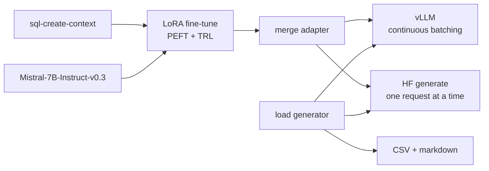

# llm-finetune-serve

LoRA fine-tune of Mistral-7B-Instruct on a text-to-SQL dataset, served with vLLM, plus a benchmark that compares vLLM's continuous batching against a naive Hugging Face `generate` server on throughput, time to first token and tail latency.

## Problem

Fine-tuning a 7B model is the easy part. Serving it is where most of the cost goes, and the gap between a naive server and a batching server is often quoted without a reproducible measurement behind it. This repo does both halves with one config-driven pipeline, then measures the serving gap with a client that controls prompt length, output length, warmup and concurrency, and records the hardware it ran on.

## Architecture



- `src/lfs/finetune.py`, `merge.py`: LoRA training and adapter merge, configured by `configs/*.yaml`, logged to a local MLflow store.
- `src/lfs/serve_vllm.py`: launches vLLM's OpenAI-compatible server.
- `src/lfs/hf_server.py`: the baseline. Same API, plain `generate`, requests served one at a time.
- `src/lfs/bench/`: async load generator, metrics, and report writer.
- `modal_app.py`: the GPU run on Modal.

ARCHITECTURE.md explains the choices.

## Quickstart

CPU smoke test. Fine-tunes Qwen2.5-0.5B-Instruct for 8 steps, merges it, serves it with the HF baseline and benchmarks it. Takes a few minutes on a laptop.

```bash
git clone https://github.com/armaanwaels/llm-finetune-serve.git
cd llm-finetune-serve
make install    # uv sync --extra train
make test
make smoke
```

GPU run on Modal. Needs a Modal account (`modal token new`). This bills your Modal account for about an hour of L4 time.

```bash
modal run modal_app.py
```

It downloads the base model, fine-tunes and merges on one L4, benchmarks vLLM and then the HF baseline, and copies `vllm.csv`, `hf-generate.csv` and the markdown tables into `results/`.

On your own Linux GPU machine:

```bash
make install-gpu
make finetune                   # configs/mistral7b.yaml
make serve &                    # vLLM on :8000
make bench SERVER=vllm
make serve-hf &                 # stop vLLM first; HF baseline on :8000
make bench SERVER=hf-generate CONCURRENCY=1,4,16
```

MLflow runs are stored in `mlflow.db`. Browse them with `uv run mlflow ui --backend-store-uri sqlite:///mlflow.db`.

## Evaluation

not yet measured on GPU; CPU smoke test passes.

Benchmark settings: 256 input tokens, 128 output tokens with `ignore_eos`, 4 warmup requests per level excluded, concurrency 1, 4, 16 and 32 for vLLM and 1, 4 and 16 for the baseline, bf16. TTFT is measured at the client. Each CSV row records the GPU, its memory use, dtype and library versions.

Data: [b-mc2/sql-create-context](https://huggingface.co/datasets/b-mc2/sql-create-context), CC BY 4.0, 78,577 rows of question, CREATE TABLE context and SQL answer. The GPU config trains on 4,000 rows and evaluates on 200. The base model is [mistralai/Mistral-7B-Instruct-v0.3](https://huggingface.co/mistralai/Mistral-7B-Instruct-v0.3), Apache 2.0, not gated.

## Decisions and tradeoffs

- **LoRA, not a full fine-tune.** About 42M trainable parameters instead of 7.2B, so the run fits on one 24 GB GPU. The cost is less capacity to learn new knowledge, which a format-heavy task like text-to-SQL does not need.
- **Merge before serving.** Both servers load the same plain checkpoint, and vLLM skips the adapter matmuls.
- **The baseline is deliberately naive.** One request at a time behind a lock is how a first `generate` server usually behaves. A static-batching baseline would be stronger; ARCHITECTURE.md lists it as a next step.
- **L4 on Modal.** The cheapest 24 GB GPU there. An A10 decodes faster for about 1.4x the price (`LFS_GPU=A10`).
- **One lockfile for training and serving.** vLLM 0.20.2 with torch 2.11 and transformers 4.57.6, the same versions the CPU smoke test runs.

## What went wrong / limitations

- No GPU numbers yet. Until `modal run modal_app.py` has run, this repo shows that the pipeline and the benchmark work, not how fast vLLM is.
- No task-quality metric. The fine-tune reports train and eval loss only. SQL execution accuracy before and after fine-tuning is the obvious next measurement.
- The HF baseline streams text at word boundaries, so its first chunk can arrive a token or two after the first token was generated. This slightly inflates its TTFT.
- vLLM does not install on macOS, so the CPU path never exercises vLLM. `serve_vllm.py` is covered only by a test of the command it builds.
- MLflow 3.16 no longer accepts a plain `./mlruns` file store, so tracking uses a SQLite file instead.
- Benchmark prompts come from the same dataset as training and may include training rows. That does not affect latency, but the prompts are not a held-out set.

## Stack

Python 3.11, uv, PyTorch, Transformers, PEFT, TRL, MLflow, vLLM, FastAPI, httpx, Modal, Docker, GitHub Actions.
