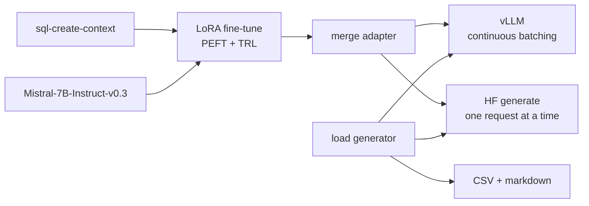

# llm-finetune-serve

LoRA fine-tune of Mistral-7B-Instruct on a text-to-SQL dataset, served with vLLM, plus a benchmark that compares vLLM's continuous batching against a naive Hugging Face `generate` server on throughput, time to first token and tail latency.

## Problem

Fine-tuning a 7B model is the easy part. Serving it is where most of the cost goes, and the gap between a naive server and a batching server is often quoted without a reproducible measurement behind it. This repo does both halves with one config-driven pipeline, then measures the serving gap with a client that controls prompt length, output length, warmup and concurrency, and records the hardware it ran on.

## Architecture



- `src/lfs/finetune.py`, `merge.py`: LoRA training and adapter merge, configured by `configs/*.yaml`, logged to a local MLflow store.
- `src/lfs/serve_vllm.py`: launches vLLM's OpenAI-compatible server.
- `src/lfs/hf_server.py`: the baseline. Same API, plain `generate`, requests served one at a time.
- `src/lfs/bench/`: async load generator, metrics, and report writer.
- `modal_app.py`: the GPU run on Modal.

ARCHITECTURE.md explains the choices.

## Quickstart

CPU smoke test. Fine-tunes Qwen2.5-0.5B-Instruct for 8 steps, merges it, serves it with the HF baseline and benchmarks it. Takes a few minutes on a laptop.

```bash
git clone https://github.com/armaanwaels/llm-finetune-serve.git
cd llm-finetune-serve
make install    # uv sync --extra train
make test
make smoke
```

GPU run on Modal. Needs a Modal account (`modal token new`). The run below took about 40 minutes and cost about $0.75.

```bash
modal run modal_app.py
```

It downloads the base model, fine-tunes and merges on one L4, benchmarks vLLM and then the HF baseline, and copies `vllm.csv`, `hf-generate.csv` and the markdown tables into `results/`.

On your own Linux GPU machine:

```bash
make install-gpu
make finetune                   # configs/mistral7b.yaml
make serve &                    # vLLM on :8000
make bench SERVER=vllm
make serve-hf &                 # stop vLLM first; HF baseline on :8000
make bench SERVER=hf-generate CONCURRENCY=1,4,16
```

MLflow runs are stored in `mlflow.db`. Browse them with `uv run mlflow ui --backend-store-uri sqlite:///mlflow.db`.

## Evaluation

Numbers below were produced by `make bench` on one NVIDIA L4 (24 GB), run on Modal with `modal run modal_app.py`, which starts each server and runs the same benchmark CLI (`lfs.bench.cli`) in the same container. Run on September 21, 2026. Raw rows, including library versions and GPU memory, are in `results/vllm.csv` and `results/hf-generate.csv`.

Settings: merged Mistral-7B-Instruct-v0.3 LoRA checkpoint, bf16, 256 input tokens, 128 output tokens with `ignore_eos`, 4 warmup requests per level excluded, closed loop at fixed concurrency. vLLM 0.20.2, torch 2.11.0, transformers 4.57.6.

| Server | Concurrency | Output tok/s | TTFT p50 | TTFT p95 | TTFT p99 | End-to-end p50 | End-to-end p95 | End-to-end p99 |
|---|---|---|---|---|---|---|---|---|
| vLLM | 1 | 17.7 | 138 ms | 144 ms | 147 ms | 7.27 s | 7.27 s | 7.28 s |
| vLLM | 4 | 67.3 | 171 ms | 173 ms | 173 ms | 7.62 s | 7.62 s | 7.62 s |
| vLLM | 16 | 231.6 | 747 ms | 1,348 ms | 1,354 ms | 9.02 s | 9.22 s | 9.22 s |
| vLLM | 32 | 404.0 | 307 ms | 2,397 ms | 2,400 ms | 9.82 s | 11.76 s | 11.77 s |
| HF generate | 1 | 15.7 | 203 ms | 273 ms | 275 ms | 8.11 s | 8.26 s | 8.38 s |
| HF generate | 4 | 15.9 | 24.4 s | 24.5 s | 24.5 s | 32.3 s | 32.3 s | 32.3 s |
| HF generate | 16 | 15.6 | 61.3 s | 116.9 s | 121.8 s | 69.3 s | 124.9 s | 129.9 s |

What the numbers say:

- At one request at a time the two servers are close: 17.7 vs 15.7 output tokens per second. A 7B model on an L4 is limited by memory bandwidth, and neither server can batch a single request.
- vLLM's throughput rises with concurrency, to 404 tokens per second at 32 concurrent requests. That is 26 times the baseline's best (15.9), and 14.8 times at 16 concurrent requests. The baseline stays flat because it serves one request at a time.
- vLLM's time to first token stays under 175 ms at p95 up to 4 concurrent requests. At 16 and 32 it rises to 1.3 and 2.4 seconds at p95, because new requests wait for prefill slots while the batch decodes. The baseline's TTFT grows with queue depth: 24 seconds at 4 concurrent requests.
- The baseline is deliberately naive. A static-batching server would narrow the gap, so the 26x figure measures continuous batching against no batching, not against the best alternative.

Fine-tune (same run, `configs/mistral7b.yaml`, logged to MLflow): one epoch over 4,000 rows in 764 s on the L4, train loss 0.078, eval loss 0.052 on 200 held-out rows. That is loss only; SQL accuracy was not measured.

The whole Modal run cost about $0.75 (Modal billing report for the app, same day).

## Decisions and tradeoffs

- **LoRA, not a full fine-tune.** About 42M trainable parameters instead of 7.2B, so the run fits on one 24 GB GPU. The cost is less capacity to learn new knowledge, which a format-heavy task like text-to-SQL does not need.
- **Merge before serving.** Both servers load the same plain checkpoint, and vLLM skips the adapter matmuls.
- **The baseline is deliberately naive.** One request at a time behind a lock is how a first `generate` server usually behaves. A static-batching baseline would be stronger; ARCHITECTURE.md lists it as a next step.
- **L4 on Modal.** The cheapest 24 GB GPU there. An A10 decodes faster for about 1.4x the price (`LFS_GPU=A10`).
- **One lockfile for training and serving.** vLLM 0.20.2 with torch 2.11 and transformers 4.57.6, the same versions the CPU smoke test runs.

## What went wrong / limitations

- One run, one GPU type. The table is a single pass on an L4; run-to-run variance was not measured, and an A10 or H100 would give different numbers.
- No task-quality metric. The fine-tune reports train and eval loss only. SQL execution accuracy before and after fine-tuning is the obvious next measurement.
- The HF baseline streams text at word boundaries, so its first chunk can arrive a token or two after the first token was generated. This slightly inflates its TTFT.
- vLLM does not install on macOS, so the CPU path never exercises vLLM. `serve_vllm.py` is covered only by a test of the command it builds.
- MLflow 3.16 no longer accepts a plain `./mlruns` file store, so tracking uses a SQLite file instead.
- Benchmark prompts come from the same dataset as training and may include training rows. Latency is unaffected; the prompts are simply not a held-out set.

## Stack

Python 3.11, uv, PyTorch, Transformers, PEFT, TRL, MLflow, vLLM, FastAPI, httpx, Modal, Docker, GitHub Actions.
